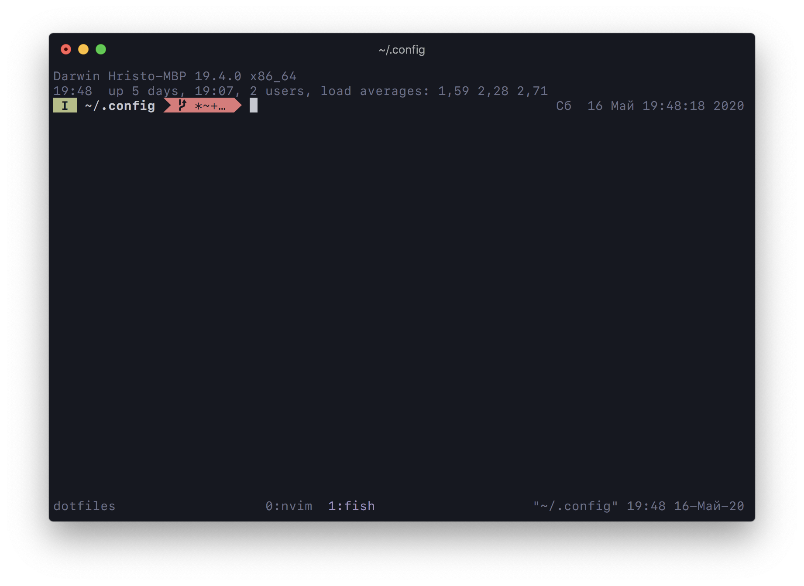

# My config files

- Vim theme: [iceberg.vim](https://github.com/cocopon/iceberg.vim)
    
- Shell: fish + oh-my-fish
    - Prompt: [bobthefish](https://github.com/oh-my-fish/theme-bobthefish)

- Terminal: [iTerm 2](https://iterm2.com)
    - Font: [SF Mono](https://developer.apple.com/fonts/) with the "Use built-in powerline glyphs" option in iTerm
    - Colour-scheme: `./iceberg.itermcolors`, derived from [iceberg.vim](https://github.com/cocopon/iceberg.vim)

- Window manager: [Amethyst](https://github.com/ianyh/Amethyst)
